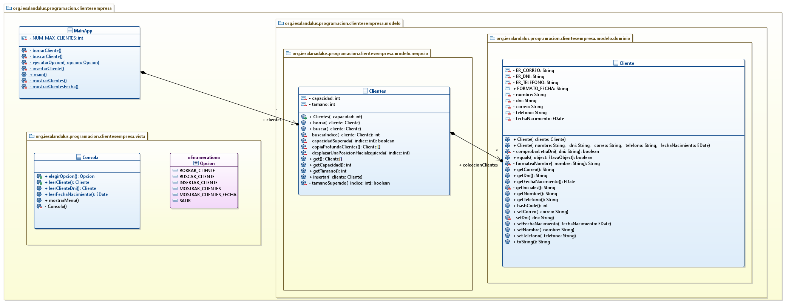

# ClientesEmpresa
## Profesor: Andrés Rubio del Río
## Alumno: 

Tu tarea va a consistir en gestionar los clientes de una empresa. La empresa quiere almacenar la fecha de nacimiento de los diferentes clientes, así como su nombre bien formateado, su DNI comprobando que es válido y su teléfono comprobando también que es válido y su correo, que por supuesto, también deberá ser válido. El programa permitirá insertar nuevos clientes, buscar clientes, borrar un cliente, mostrar todos los clientes y mostrar los clientes que hayan nacido en una fecha determinada.

En este repositorio GitHub hay un esqueleto de proyecto gradle que ya lleva incluidos todos los test necesarios que el programa debe pasar y las dependencias, entre ellas la de la librería entrada. 

Para ello te pongo un diagrama de clases para el mismo y poco a poco te iré explicando los diferentes pasos a seguir:

#### Primeros Pasos

1. Lo primero que debes hacer es un fork de este repositorio.
2. Clona tu repositorio remoto recién copiado en **GitHub** a un repositorio local que será donde irás realizando lo que a continuación se te pide. Modifica el archivo `README.md` para que incluya tu nombre en el apartado "Alumno". Realiza tu primer commit.

#### Clase `Cliente`

1. Crea la clase `Cliente` en el paquete indicado en el diagrama.
2. Crea los diferentes atributos que se indican en el diagrama de clases con su visibilidad adecuada.
3. Crea el método `formateaNombre`. Este método debe normalizar un nombre eliminando caracteres en blanco de sobra y poniendo en mayúsculas la primera letra de cada palabra y en minúsculas las demás.
4. Crea el método `comprobarLetraDni`. Este método hará uso de los grupos de las expresiones regulares (para ello has debido definir la expresión regular con grupos) para quedarse con el número por un lado y con la letra por otro. Para saber si la letra es válida puedes seguir las instrucciones del siguiente enlace: Comprobar letra dni.
5. Crea los métodos get y set con la visibilidad adecuada. Estos métodos deberán hacer las comprobaciones pertinentes y en su caso lanzar la excepción correspondiente.
6. Crea el **constructor con parámetros**.
7. Crea el **constructor copia**.
8. Crea los métodos `equals` y `hashCode`, sabiendo que dos clientes se considerarán iguales si su DNI es el mismo.
9. Crea el método `getIniciales`. Este método devolverá las iniciales del nombre.
10. Crea el método `toString`. Este método devolverá una cadena representando la información de los diferentes atributos, pero para el caso del nombre le antepondrá sus iniciales encerradas en paréntesis. Realiza un commit con la creación de esta clase.

#### Clase `Clientes`

1. Crea la clase `Clientes` en el paquete indicado en el diagrama.
2. Crea los diferentes atributos que se indican en el diagrama de clases con su visibilidad adecuada.
4. Crea los métodos `get` (sin parámetros) que se indican en el diagrama de clases.
5. Crea los métodos `capacidadSuperada` y `tamanoSuperado`.
6. Crea el método `buscarIndice` que buscará dentro de la colección de clientes, al cliente pasado como parámetro y devolverá su índice en el caso que lo encuentre o el tamaño más uno en caso de que no lo encuentre.
7. Crea el método `insertar` que insertará una copia del cliente pasado como parámetro detrás del último cliente existente en la colección, debiendo lanzar las excepciones pertinentes ante cualquier situación anómala.
8. Crea el método `buscar` que devolverá la copia del cliente que estamos buscando o null en caso de que no la encuentre.
9. Crea el método `desplazarUnaPosicionHaciaIzquierda` al que le pasamos un índice y desplazará una posición a la izquierda todas los clientes de la colección que estén a su derecha.
10. Crea el método `borrar` que borrará al cliente pasado como parámetro, desplazando hacia la izquierda todas los clientes que estén a su derecha en caso de encontrarla, o bien lanzará una excepción en caso contrario.
11. Crea el método `get` que devolverá una copia de todos los clientes existentes. Realiza un commit con la creación de esta clase.

#### Enumerado `Opcion`

1. Crea el enumerado `Opcion` en el paquete indicado en el diagrama, conteniendo los literales: que contenga los literales: `SALIR`, `INSERTAR_CLIENTE`, `BUSCAR_CLIENTE`, `BORRAR_CLIENTE`, `MOSTRAR_CLIENTES_FECHA`, `MOSTRAR_CLIENTES`.
2. Realiza un commit con la creación de este enumerado.

#### Clase `Consola`

1. Crea la clase `Consola` en el paquete indicado en el diagrama.
2. Crea su **constructor** teniendo en cuenta que es una clase de utilidades y que no tiene sentido instanciar objetos de la misma.
3. Crea el método `mostrarMenu` que mostrará las diferentes opciones de nuestro programa (insertar, buscar, borrar, mostrar todas los clientes, mostrar los clientes que hayan nacido en una fecha concreta y salir).
4. Crea el método `elegirOpcion` que pedirá que elijamos la opción y devolverá la instancia del enumerado `Opcion` correspondiente.
5. Crea el método `leerCliente` que nos pedirá los datos correspondientes al cliente y devolverá el mismo en el caso que los datos introducidos sean correctos o propague la excepción correspondiente en caso contrario.
6. Crea el método `leerClienteDni` que nos pedirá el dni del cliente y devolverá el cliente cuyo dni coincida con el introducido. En caso contrario, deberá propagar la excepción correspondiente.
7. Crea el método `leerFechaNacimiento` que nos pedirá que introduzcamos una cadena correspondiente a una fecha en el formato adecuado y devolverá el objeto **LocalDate** correspondiente. Esto se repetirá mientras la fecha introducida no sea válida. Realiza un commit con la creación de esta clase.

#### Clase `MainApp`

1. Crea la clase `MainApp` en el paquete indicado en el diagrama:
2. Crea los diferentes atributos que se indican en el diagrama de clases con su visibilidad adecuada.
3. Crea el método `insertarCliente` que nos pedirá los datos de un cliente y lo insertará si es posible o informará del problema en caso contrario.
4. Crea el método `buscarCliente` que nos pedirá el dni de un cliente, mostrándonos a dicho cliente o nos informará de que no existe.
5. Crea el método `borrarCliente` que nos pedirá el dni de un cliente, borrándolo si es posible o informará del problema en caso contrario.
6. Crea el método `mostrarClientes` que mostrará todos los clientes almacenados si es que hay o si no, nos informará de que no hay clientes.
7. Crea el método `mostrarClientesFecha` que nos pedirá una fecha de nacimiento y mostrará todas los clientes almacenados cuya fecha de nacimiento sea la indicada, si no, nos informará de que no hay clientes con dicha fecha de nacimiento.
8. Crea el método `ejecutarOpcion` que dada una opción, la ejecute.
9. Crea el método `main` que nos mostrará el menú de la aplicación, nos pedirá una opción y la ejecutará mientras no elijamos la opción salir. Realiza un commit con la creación de esta clase. Finalmente realiza el push hacia tu repositorio remoto en GitHub.

#### Se valorará:

- La indentación debe ser correcta en cada uno de los apartados.
- Los identificadores utilizados deben ser adecuados y descriptivos.
- Se debe utilizar la clase `Entrada` para realizar la entrada por teclado que se encuentra como dependencia de nuestro proyecto en la librería `entrada`.
- El programa debe pasar todas las pruebas que van en el esqueleto del proyecto y toda entrada del programa será validada, para evitar que el programa termine abruptamente debido a una excepción.
- La corrección ortográfica tanto en los comentarios como en los mensajes que se muestren al usuario.
